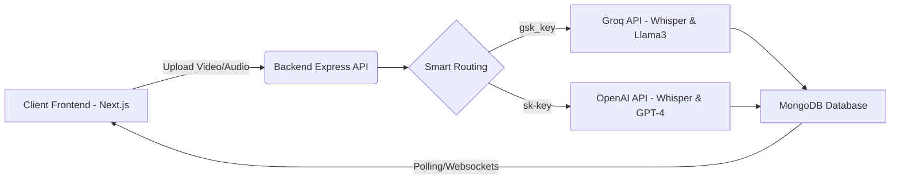

<div align="center">
  
# 🎙️ NexusAI: Intelligent Meeting-to-Tasks Converter

An enterprise-grade, full-stack AI application that effortlessly converts audio, video, and text meetings into highly accurate, natively translated transcripts, professional summaries, and actionable task lists.

[](https://nextjs.org/)
[](https://nodejs.org/)
[](https://www.mongodb.com/)
[](https://groq.com/)
[](https://openai.com/)

[**Live Demo**](https://nexus-ai-converter-frontend.vercel.app/) • [**Report Bug**](https://github.com/muhammadtaimoorajmal/nexus-ai-converter/issues) • [**Request Feature**](https://github.com/muhammadtaimoorajmal/nexus-ai-converter/issues)

</div>

## 📸 Sneak Peek

> **Note:** Replace the placeholder below with an actual screenshot or GIF of the application!

<div align="center">
  
</div>

## 🚀 Overview

**NexusAI** is a premium web platform designed to streamline productivity by completely automating post-meeting workflows. By leveraging state-of-the-art AI models (Whisper-Large-v3 and Llama-3.3), the system processes uploaded meetings, automatically detects the spoken language (English, Urdu, Spanish, Punjabi, etc.), and generates native-language transcripts along with intelligent, priority-sorted action items.

The architecture strictly separates the frontend client from the background AI processing engine to guarantee high performance, smooth UI rendering, and asynchronous heavy-lifting.

## ✨ Key Features

- 🎯 **Multi-Modal Uploads**: Seamlessly upload `.mp4` video files, `.mp3`/`.wav` audio files, or plain text meeting notes.
- 🌍 **Auto-Language Detection**: The AI natively identifies the spoken language and transcribes it directly in that exact language with near 100% accuracy.
- ⚡ **Smart Provider Auto-Routing**: Paste your API key in settings, and the backend intelligently auto-routes processing to **Groq** (insanely fast, free) or **OpenAI** (premium) based on the key signature (`gsk_` vs `sk-`).
- ✅ **Automated Task Extraction**: Automatically parses transcripts to find actionable "To-Do" items, assigning them titles, descriptions, and dynamic priority levels (High, Medium, Low).
- 🎨 **Beautiful Dashboard**: A "Mariana Trench" level UI built with Next.js, Tailwind CSS, and Recharts, featuring full Dark Mode support, gorgeous micro-animations, and dynamic data visualization.
- 🔄 **Asynchronous Processing Pipeline**: Videos are processed in the background. The UI automatically polls and updates from a "Processing" state to "Completed" with smooth transitions.

## 🏗️ System Architecture



## 🛠️ Tech Stack

### Frontend
- **Framework:** Next.js 14 (React)
- **Styling:** Tailwind CSS & Framer Motion
- **UI Components:** shadcn/ui & Radix UI
- **State Management:** Zustand

### Backend
- **Runtime:** Node.js with TypeScript
- **Framework:** Express.js
- **Database:** MongoDB (Mongoose ORM)
- **AI SDK:** Official OpenAI Node SDK (Routed to Groq/OpenAI)

## ⚙️ Local Installation & Setup

### 1. Prerequisites
- **Node.js** (v18+)
- **MongoDB** (Running locally on `mongodb://localhost:27017` or Atlas)
- **Groq API Key** (Free from console.groq.com)

### 2. Clone the Repository
```bash
git clone https://github.com/muhammadtaimoorajmal/nexus-ai-converter.git
cd nexus-ai-converter
```

### 3. Install Dependencies
This project uses a monorepo structure. You need to install dependencies for both the frontend and backend.
```bash
# Install frontend packages
cd apps/frontend
npm install

# Install backend packages
cd ../backend
npm install
```

### 4. Environment Variables
Create a `.env` file in the `apps/backend/` directory:
```env
PORT=5000
MONGO_URI=mongodb://127.0.0.1:27017/meeting-tasks-db
JWT_SECRET=your_super_secret_key_here
```

### 5. Run the Application
You can run both the frontend and backend concurrently from the root directory.
```bash
# Start the entire stack
npm run dev
```
- **Frontend:** http://localhost:3000
- **Backend API:** http://localhost:5000

## 📝 Usage Guide

1. **Create an Account**: Register and log in.
2. **Configure AI Engine**: Go to the **Settings** page and paste your Groq API Key (`gsk_...`). The system will auto-detect and route your requests to Groq's high-speed Whisper servers.
3. **Upload a Meeting**: Go to the Dashboard and click "New Meeting". Select a video/audio file.
4. **View Results**: Click on the processing meeting. Once complete, view your perfectly translated transcript, summary, and organized action items!

## 🛣️ Roadmap

- [ ] Add Google Calendar integration to directly schedule tasks.
- [ ] Support for direct meeting bot recording (Zoom, Google Meet).
- [ ] Export transcripts to PDF / Notion.
- [ ] Implement team workspaces.

## 🤝 Contributing

Contributions are what make the open source community such an amazing place to learn, inspire, and create. Any contributions you make are **greatly appreciated**.

1. Fork the Project
2. Create your Feature Branch (`git checkout -b feature/AmazingFeature`)
3. Commit your Changes (`git commit -m 'Add some AmazingFeature'`)
4. Push to the Branch (`git push origin feature/AmazingFeature`)
5. Open a Pull Request

---

<div align="center">
  <i>Developed with ❤️ by <a href="https://github.com/muhammadtaimoorajmal">Muhammad Taimoor Ajmal</a></i>
</div>
