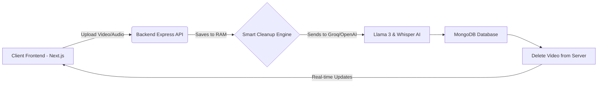

<div align="center">
  
  
  <h1 align="center">🎙️ NexusAI: Meeting-to-Tasks Converter</h1>

  <p align="center">
    <strong>Turn your meetings into clear, actionable plans automatically.</strong><br/>
    An enterprise-grade, full-stack AI application that effortlessly converts audio, video, and text meetings into highly accurate transcripts, professional summaries, and priority-sorted action lists.
  </p>

  <p align="center">
    <a href="https://nexus-ai-converter-frontend.vercel.app/"><strong>🔥 View Live Demo</strong></a>
    ·
    <a href="https://github.com/muhammadtaimoorajmal/nexus-ai-converter/issues">Report Bug</a>
    ·
    <a href="https://github.com/muhammadtaimoorajmal/nexus-ai-converter/issues">Request Feature</a>
  </p>

  <p align="center">
    
    
    
    
  </p>
</div>

<hr />

## 📸 Sneak Peek

> **Tip:** You can drag and drop your screenshots here to replace these placeholders!

<div align="center">
  
</div>

<br/>

## 🚀 Overview

**NexusAI** is a premium web platform designed to streamline productivity by completely automating post-meeting workflows. By leveraging state-of-the-art AI models (**Whisper-Large-v3** and **Llama-3.3**), the system processes uploaded meetings, automatically detects the spoken language, and generates native-language transcripts along with intelligent, priority-sorted action items.

The architecture strictly separates the frontend client from the background AI processing engine to guarantee high performance, smooth UI rendering, and asynchronous heavy-lifting.

---

## ✨ Key Features

- 🎯 **Multi-Modal Uploads**: Seamlessly upload `.mp4` video files, `.mp3`/`.wav` audio files, or plain text meeting notes.
- 🌍 **Auto-Language Detection**: The AI natively identifies the spoken language and transcribes it directly in that exact language with near 100% accuracy.
- ⚡ **Smart Auto-Deletion Engine**: Uploaded media files are automatically scrubbed from the server the millisecond processing is complete to ensure infinite scalability and zero memory leaks.
- ✅ **Automated Task Extraction**: Automatically parses transcripts to find actionable "To-Do" items, assigning them titles, descriptions, and dynamic priority levels (High, Medium, Low).
- 🎨 **Beautiful UI/UX**: A "Mariana Trench" level UI built with Next.js, Tailwind CSS, and Shadcn UI, featuring full Dark Mode support, gorgeous micro-animations, and dynamic data visualization.
- 📱 **100% Mobile Responsive**: Includes a stunning slide-out mobile sidebar for on-the-go meeting uploads.

---

## 🔑 CRITICAL STEP: How to Setup Your Free AI Engine

To process your videos and meetings, you **must** configure your AI Engine in the Settings page. We highly recommend using **Groq** because it is 100% free and lightning-fast.

### Step-by-Step Guide:
1. **Get your Free API Key:**
   - Go to [console.groq.com](https://console.groq.com/keys).
   - Sign in with Google or your preferred method.
   - Click **Create API Key** and copy the string provided (it will start with `gsk_`).
2. **Configure NexusAI:**
   - Go to your live [NexusAI Website](https://nexus-ai-converter-frontend.vercel.app/).
   - Click your Avatar in the top right, or open the Sidebar, and click **Settings**.
   - Under the "Profile Details" card, select **Groq** from the AI Engine Provider dropdown.
   - Paste your copied API Key into the Groq API Key input box.
   - Click **Save Profile**.
3. **You're Done!** You can now upload large videos on the Dashboard, and the AI will extract transcripts and tasks in seconds!

---

## 🏗️ System Architecture



---

## 🛠️ Tech Stack

### Frontend
- **Framework:** Next.js 14 (React)
- **Styling:** Tailwind CSS & Framer Motion
- **UI Components:** Shadcn/ui & Radix UI
- **State Management:** Zustand

### Backend
- **Runtime:** Node.js with TypeScript
- **Framework:** Express.js
- **Database:** MongoDB Atlas (Mongoose ORM)
- **AI SDK:** Official OpenAI Node SDK (Routed to Groq's high-speed endpoints)

---

## ⚙️ Local Installation & Setup

If you want to run this application on your local machine, follow these steps:

### 1. Prerequisites
- **Node.js** (v18+)
- **MongoDB** (Running locally on `mongodb://localhost:27017` or Atlas)

### 2. Clone the Repository
```bash
git clone https://github.com/muhammadtaimoorajmal/nexus-ai-converter.git
cd nexus-ai-converter
```

### 3. Install Dependencies
This project uses a monorepo structure. You need to install dependencies for both the frontend and backend.
```bash
# Install frontend packages
cd apps/frontend
npm install

# Install backend packages
cd ../backend
npm install
```

### 4. Environment Variables
Create a `.env` file in the `apps/backend/` directory:
```env
PORT=5000
MONGO_URI=mongodb://127.0.0.1:27017/meeting-tasks-db
JWT_SECRET=your_super_secret_key_here
```

### 5. Run the Application
You can run both the frontend and backend concurrently from the root directory.
```bash
# Start the entire stack
npm run dev
```
- **Frontend:** http://localhost:3000
- **Backend API:** http://localhost:5000

---

## 🛣️ Roadmap

- [ ] Add Google Calendar integration to directly schedule tasks.
- [ ] Support for direct meeting bot recording (Zoom, Google Meet).
- [ ] Export transcripts to PDF / Notion.
- [ ] Implement team workspaces.

---

## 🤝 Contributing

Contributions are what make the open source community such an amazing place to learn, inspire, and create. Any contributions you make are **greatly appreciated**.

1. Fork the Project
2. Create your Feature Branch (`git checkout -b feature/AmazingFeature`)
3. Commit your Changes (`git commit -m 'Add some AmazingFeature'`)
4. Push to the Branch (`git push origin feature/AmazingFeature`)
5. Open a Pull Request

---

<div align="center">
  <i>Architected & Developed with ❤️ by <a href="https://github.com/muhammadtaimoorajmal">Muhammad Taimoor Ajmal</a></i><br/>
  <strong>Full-Stack AI Solutions Engineer</strong>
</div>
